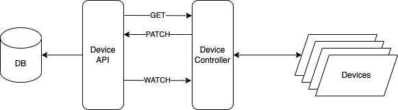
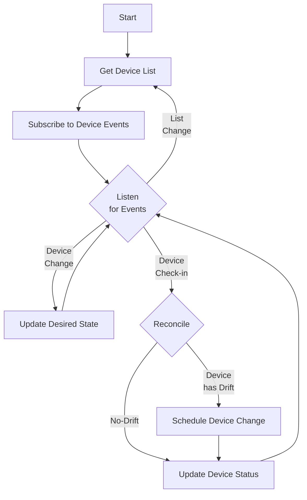

# Device Controller

A declarative approach to device configuration inspired by K8s.



* **DB** - The DB contains various entities that are related to devices such as Campaigns, Schedules, etc.
* **Device API** - A REST API that understands the device entities and contains the business logic that can determine the desired state of devices.
* **Device Controller** - A process which runs a control loop which attempts to keep the actual device configuration in line with the desired configuration receive from the Device API.

## Loop

Device Controller logic flow



* **Get Device List** - Perform an API `GET` on Device API to get a list of devices
* **Subscribe to Device Events** - For each device in the list, subscribe to receive device events via the `WATCH` method. Alternately, if the API does not support a `WATCH` method then something like Redis with Websockets or a message broker could be used.
  * **Device Change Events** - These are events from the Device API that reflect a change in desired state for a given device.
  * **Device Check-in Events** - These are events from the device in the field that reflect the actual state for a given device.
* **Listen for Events** - The main loop of the device controller is to wait for events, act on events when received then go back to waiting on events.
* **Update Desired State** - When a *Device Change Event* is received, this means something changed on the backend and the controller needs to refresh its desired state.
* **Reconcile** - When a device checks-in its actual state is reconciled against the desired state to determine if there is any drift a.k.a. differences.
  * **Device has Drift** - If the device has drift then the controller schedules the necessary changes that will bring it inline with the desired state
  * **Device has no Drift** - If no changes are needed then simply update the device status
* **Update Device Status** - Perform an API `PATCH` on the Device API to update the device status

## Methods

Examples of the Device API's REST methods.

## GET

* GET `/devices` returns a list of device object `<[]Device>`
* GET `/devices/<id>` returns a device object `<Device>`

Example of a device object:

```yaml
apiVersion: v1
kind: Device
metadata:
  name: honey-pod 
spec:
  id: 12345
  model: HAL9000
  osVersion: v1.2.3
  lastOsUpgrade: Wed, 7 Jun 2023 11:12:03 +0000
  lastTimeSync: Sat, 1 Jul 2023 10:56:25 +0000
```

## WATCH

* GET `/devices?watch` returns a list of device object `<[]Device>`

If you sent an HTTP GET request with the ?watch query parameter, the Device API will notify the controller of changes

For a detail example of `WATCH` see [Efficient Detection of Changes](https://kubernetes.io/docs/reference/using-api/api-concepts/#efficient-detection-of-changes) in the K8s doc.

## PATCH

* PATCH `/devices/<id>` update a device object `<Device>`
