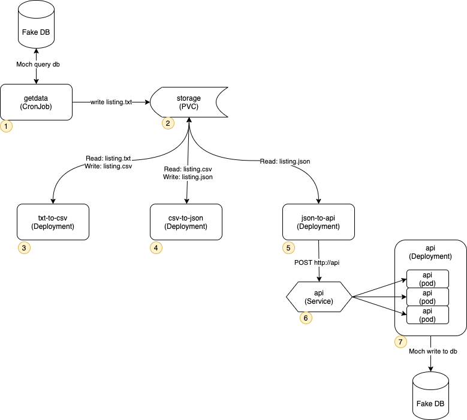

# K8S Pipe

A POC data pipeline on k8s

## Before you get started

You need a k8s cluster.  If you are running docker-desktop then you will need to install the [local-path-provisioner](https://github.com/rancher/local-path-provisioner) from Rancher.  This will be needed so you can create a PVC that is shared among all the pods. 

To verify your install check that you have a `local-path` storage class.

```bash
kubectl get sc
NAME                   PROVISIONER             RECLAIMPOLICY   VOLUMEBINDINGMODE      ALLOWVOLUMEEXPANSION   AGE
local-path (default)   rancher.io/local-path   Delete          WaitForFirstConsumer   false                  10d
```

## Install

Clone this project. Navigate to root of the project and run the following command.  This will deploy k8s resources into the cluster.

```sh
kubectl apply -f ./k8s
```

## About this project

Files in this project:

```text
.
├── README.md                   - This document
└── k8s                         - k8s manifest files
    ├── cronjobs.yaml           - a cronjob that will mock fetch data on a schedule
    |
    ├── deployments.yaml        - several deployments, that all mount the same storage volume  
    |                             The deployments form a "Data Processing Pipeline"
    |
    ├── pvcs.yaml               - a PVC that creates a shared volume
    |                             requires local-path-provisioner
    |
    └── serivces.yaml           - a service to expose the API
```

## Overview



### 1 - getdata (CronJob)

This is a CronJob that runs every minute, see `schedule: '*/1 * * * *'`.  Chenge the [cronjob expression](https://crontab.guru/) if you want it to run on a different schedule. This is suppose to represent reading from a database and writing the results to a text file.  In this case it does not actually read a db but instead generates a file listing and uses that as the source data.

Below is an example of what `listing.txt` looks like:

```text
-r--------    1 root     root            19 Mar 19 23:57 /sys/module/sr_mod/sections/.init.text
-r--------    1 root     root            19 Mar 19 23:57 /sys/module/sr_mod/sections/.note.gnu.build-id
-r--------    1 root     root            19 Mar 19 23:57 /sys/module/sr_mod/sections/.text
-r--------    1 root     root            19 Mar 19 23:57 /sys/module/sr_mod/sections/.data
-r--------    1 root     root            19 Mar 19 23:57 /sys/module/sr_mod/sections/.smp_locks
-r--------    1 root     root            19 Mar 19 23:57 /sys/module/sr_mod/sections/.rodata.str1.1
-r--------    1 root     root            19 Mar 19 23:57 /sys/module/sr_mod/sections/.parainstructions
-r--------    1 root     root            19 Mar 19 23:57 /sys/module/sr_mod/sections/.rodata.str1.8
```

Notice the following. Is used to mount the storage volume that is shared by other containers.

```yaml
...
          volumes:
          - name: data
            persistentVolumeClaim:
              claimName: storage
```

### 2 - storage (PVC)

This PVC will automaticly create a volume on one of the nodes. This volume can be shared by other containers.

### 3 - text-to-csv (Deployment)

This deployment mounts the storage volume and looks for a file called `listing.txt`.  If found, it will convert it to csv and output the results to `listing.csv`.  **Note** the `listing.txt` file is deleted during processing to avoid processing the same file twice.

Below is an example of what `listing.csv` looks like:

```text
-r--r--r--,1,root,root,4096,Mar 20 00:40,/sys/kernel/irq/7/type
-r--r--r--,1,root,root,4096,Mar 20 00:40,/sys/kernel/irq/7/chip_name
-r--r--r--,1,root,root,4096,Mar 20 00:40,/sys/kernel/irq/7/per_cpu_count
-r--r--r--,1,root,root,4096,Mar 20 00:40,/sys/kernel/irq/7/name
-r--r--r--,1,root,root,4096,Mar 20 00:40,/sys/kernel/irq/25/wakeup
-r--r--r--,1,root,root,4096,Mar 20 00:40,/sys/kernel/irq/25/hwirq
-r--r--r--,1,root,root,4096,Mar 20 00:40,/sys/kernel/irq/25/actions
-r--r--r--,1,root,root,4096,Mar 20 00:40,/sys/kernel/irq/25/type
-r--r--r--,1,root,root,4096,Mar 20 00:40,/sys/kernel/irq/25/chip_name
```

### 4 - csv-to-json (Deployment)

This deployment mounts the storage volume and looks for a file called `listing.csv`.  If found, it will convert it to json and output the results to `listing.json`.  **Note** the `listing.json` file is deleted during processing to avoid processing the same file twice.

Below is an example of what `listing.json` looks like. Notice, there is one json document per line.

```json
{"mod":"-r--r--r--","no":"1","user":"root","group":"root","usrno":"0","date":"Mar 20 00:49","file":"/proc/12/task/12/net/icmp"}
{"mod":"-r--r--r--","no":"1","user":"root","group":"root","usrno":"0","date":"Mar 20 00:49","file":"/proc/12/task/12/net/igmp"}
{"mod":"-r--r--r--","no":"1","user":"root","group":"root","usrno":"0","date":"Mar 20 00:49","file":"/proc/12/task/12/net/raw6"}
{"mod":"-r--r--r--","no":"1","user":"root","group":"root","usrno":"0","date":"Mar 20 00:49","file":"/proc/12/task/12/net/snmp"}
{"mod":"-r--r--r--","no":"1","user":"root","group":"root","usrno":"0","date":"Mar 20 00:49","file":"/proc/12/task/12/net/stat/rt_cache"}
{"mod":"-r--r--r--","no":"1","user":"root","group":"root","usrno":"0","date":"Mar 20 00:49","file":"/proc/12/task/12/net/stat/nf_conntrack"}
{"mod":"-r--r--r--","no":"1","user":"root","group":"root","usrno":"0","date":"Mar 20 00:49","file":"/proc/12/task/12/net/tcp6"}
{"mod":"-r--r--r--","no":"1","user":"root","group":"root","usrno":"0","date":"Mar 20 00:49","file":"/proc/12/task/12/net/udp6"}
```

### 5 - json-to-api (Deployment)

This deployment mounts the storage volume and looks for a file called `listing.json`.  Note, that each line in `listing.json` is a json document. For each document in `listing.json` a POST to the API is made by hitting the service endpoint at `http:///api`

Below is an example the logs for this pod.  The `Post doc to api:` log entry shows the document sent to the API and the next line shows the response from the API. Notice, the container in the response is different.  That is because the `api` service is load balancing request over multiple replicas.  

```txt
--------------------------------------------------------------------

Post doc to api: {"mod":"-rw-r--r--","no":"1","user":"root","group":"root","usrno":"0","date":"Mar 19 23:57","file":"/proc/irq/26/smp_affinity_list"}
{ response: ok, container: api-9b865649-v27jq}

--------------------------------------------------------------------

Post doc to api: {"mod":"-r--r--r--","no":"1","user":"root","group":"root","usrno":"0","date":"Mar 19 23:57","file":"/proc/irq/26/effective_affinity"}
{ response: ok, container: api-9b865649-c2bg7}

--------------------------------------------------------------------

Post doc to api: {"mod":"-r--r--r--","no":"1","user":"root","group":"root","usrno":"0","date":"Mar 19 23:57","file":"/proc/irq/26/effective_affinity_list"}
{ response: ok, container: api-9b865649-v27jq}

--------------------------------------------------------------------
```

### 6 - api (Service)

A service listening at `http://api` and load balancing over all the pods in the `api` deployment.

### 7 - api (Deployment)

This deployment is meant to represent an API that writes to a db, but it does not actually write to db. It just responds as if it did. It is listening on port 80 and will respond to any request with a json document that looks like the following:  

```json
{ response: ok, container: api-9b865649-v27jq}
```

Notice, the pod name is passed back to the client. If the API is not keeping up with the requests you can increase the number of replicas.
