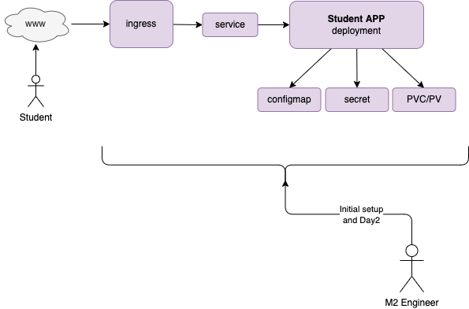

# Operators

In this section:

```text
.
├── deck            # A slide deck that take you through the demo
├── student-opr     # Project to hold our operator       
└── student-ui      # Next.js project that hits the K8s API to control our operator
```

## Introduction

* How can we apply Software Engineering (SE) techniques to Ops?
* K8s operator pattern as one possible approach

## Agenda

* Look at a use case for a <u>Student App</u>
* Identify the operational requirements
* Design and build a <u>Student Admin Operator</u> to address these requirements
* Demo the operator

---

## Use Case

A local university asks M2 to create an application for their students.  
The application would enable students to post research files and other content so they can more easily collaborate with other students.

The university prefers that each student have an independent instance of the app installed in the student's K8s namespace. This will allow the university to use existing security software which can monitor student namespaces in real time and shut them down if needed.

* Student content server app for collaboration
* One instance of the app for each student

---

## The Student App w/Human Operator



---

### Student App

* **Student APP** - Next.js content server app that has the UI and API endpoints
* **ingress** - use to allow students to connect from outside the cluster
* **service** - use to load balance traffic over the student app
* **configmap** - used to store student profile
* **secret** - used to hold student sensitive information such as PII
* **PVC/PV** - storage use to hold content uploaded by the student

### Ops

* **Helm chart** - use to manually deploy the Student App
* **run-book**  -  describes how to setup and configure the Student App
* **support contract** - An ongoing support contract with M2 is created for performing Day 2 activities; upgrades, data migration (student name change, migrate to new namespace) etc...

---

## Operational Requirements

The amount of time spent on Day 2 activities is growing as the number of students grow. The university would like have one of their student employees perform some if not all of the new student onboarding tasks.  This way they don't have to open an M2 ticket for each new student. This will help them reduce their service contract costs. They want to only call M2 when they have problems not for the routine tasks.

* Create a <u>Student Admin Operator</u> to automate the install
* Create an <u>Student Admin UI</u> to use the operator
* The UI must enable university staff/non-admins to use the operator

---

## The Student App w/K8S Operator


---

### StudentAdmin Operator

* **StudentAdmin Operator** - a k8s operator that will deploy new instances of the **Student App**, remove old instances of the app and various Day 2 activities. It will also monitor the state of all the apps to ensure all is well.
* **Student Admin UI** - A simple app that allows someone on the university staff to create, read, update and delete **Student** resources.

---

## Kubernetes Controllers

To understand how operators work we need a little background on how Kubernetes controllers.

### Controller Loop

>In robotics and automation, a control loop is a non-terminating loop that regulates the state of a system.

Here is one example of a control loop: a thermostat in a room.


---

## Controllers

The Kubernetes control plane consists of a core component known as the kube-controller-manager. This component is responsible for running different types of controllers that maintain the overall desired state of the cluster. All the controllers are packaged and shipped in the kube-controller-manager, which is a single daemon.

### Deployment Example (Sequence Diagram)


---

## Deployment Example (Pub/Sub)


An operator will contain one or more custom controllers organized around an application. In our case we have the **StudentAdmin** operator with a single custom controller that will fulfill the same core functionality of monitoring resources, namely the **Student** resource, and acting upon any changes that are detected when they occur.


---

## CRDs

Custom Resource Definitions (CRDs) are used to extend the k8s api. Below is the CRD for our **Student App**.

```yaml
apiVersion: apiextensions.k8s.io/v1
kind: CustomResourceDefinition
  name: students.miletwo.us
spec:
  # group name to use for REST API: /apis/<group>/<version>
  group: miletwo.us
  versions:
    - name: v1
      # Each version can be enabled/disabled by Served flag.
      served: true
      # One and only one version must be marked as the storage version.
      storage: true
      schema:
        openAPIV3Schema:
          type: object
          properties:
            spec:
              type: object
              properties:
                studentSpec:
                  type: string
  # either Namespaced or Cluster
  scope: Namespaced
  names:
    # plural name to be used in the URL: /apis/<group>/<version>/<plural>
    plural: students
    # singular name to be used as an alias on the CLI and for display
    singular: student
    # kind is normally the CamelCased singular type. Your resource manifests use this.
    kind: Student
    # shortNames allow shorter string to match your resource on the CLI
    shortNames:
    - stu
```

---

## Extend K8s API

The CRD will extend the k8s API by adding `Students` endpoints. Let's apply this to the cluster and see what happens.

```sh
# Create cluster
podman machine start
kind create cluster

# CRDs before
kubectl get crd
  
# Register the Student Custom Resource with the k8s API
kubectl apply -f demo/operator/student-opr/crd/crds.yaml

# Look around
kubectl api-resources | more
kubectl get crd
```

---

## Open API Spec Demo

Let's understand our new endpoints better by looking at the Open API spec. All k8s API endpoints are based on the Open API spec. Let's take a look.

```sh
# The kube proxy give us authenticated access to the k8s API for testing
kubectl proxy

# Download the open api spec from the cluster
curl 127.0.0.1:8001/openapi/v2 > swagger.json

# Use the swagger UI to view the spec
podman run -it --rm -p 8081:8080 -e SWAGGER_JSON=/swagger.json -v $(pwd)/swagger.json:/swagger.json  swaggerapi/swagger-ui
```


---

## Edit Students via CLI

```sh
# Create student
echo "
apiVersion: "miletwo.us/v1"
kind: Student
metadata:
  name: kim
spec:
  studentSpec: "the spec"
" | kubectl apply -f -

# Read student
kubectl get students
kubectl get students kim -oyaml
```

---

## Edit Students via REST

```sh
# The kube proxy give us authenticated access to the k8s API for testing
kubectl proxy

# Get the list of students
curl http://localhost:8001/apis/miletwo.us/v1/namespaces/default/students | jq .

# First edit demo/operator/student-opr/sample/student.yaml
# Create Student via REST
curl -v  -X POST \
  -H "Content-Type: application/yaml" \
  --data-binary @"demo/operator/student-opr/sample/student.yaml" \
  http://localhost:8001/apis/miletwo.us/v1/namespaces/default/students

# Delete via rest 
curl -v  -X DELETE \
  -H "Content-Type: application/yaml" \
  http://localhost:8001/apis/miletwo.us/v1/namespaces/default/students/kim

```

---

## Operator

We can create `Student` resources but nothing is happening. We want the **Student App** to get deployed when a new `Student` resource is created.

```sh
# Install the Studen Admin Operator
kubectl apply -f demo/operator/student-opr/manifests
```

Now we can create a student resource and the operator will create other resources automatically.  And if we delete the student resource things get cleaned up.

```sh
# Create student
kubectl apply -f demo/operator/student-opr/sample/student.yaml

# View resources created
kubectl get student,pods,secrets,cm,svc,deployment -l student=tony

# View the student app
open http://localhost:8001/api/v1/namespaces/default/services/tony/proxy/

# Delete student
kubectl delete student tony

# Verify cleanup
kubectl get student,pods,secrets,cm,svc,deployment -l student=tony

```

What does the operator create?

* it created a secret with a unique value for the new student
* it created a deployment to host a web server (replica = 2 for HA)
* it created a service to load balance over the web server pods
* it create personalized content for the student

---

## Student Admin UI App

Finally show how the **Student Admin UI** can replace the CLI method above (but it is nice to have the CLI when you want it)

```sh
kubectl proxy

cd demo/operator/student-ui
npm install
npm run dev

open http://localhost:3000
```

View the newly created content server

```sh
# Replace {name} with the student name
http://localhost:8001/api/v1/namespaces/default/services/{name}/proxy/
```
